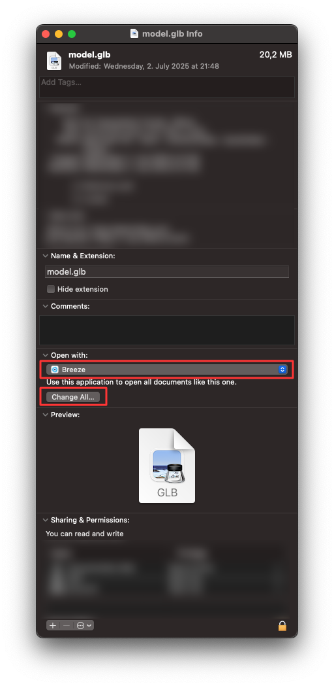
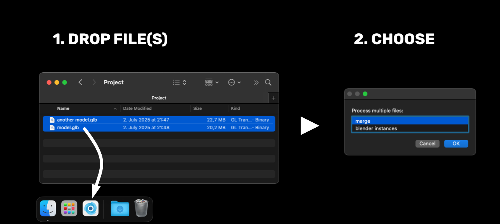

# Breeze

A lightweight Blender launcher for MacOS built with Automator.

# Install

# Features

- [Blender as default Application](#blender-as-default-application)
- [Choose Blender Version](#choose-blender-version)
- [Open Multiple Instances of Blender](#open-multiple-instances-of-blender)
- [Handle Multiple Files](#handle-multiple-files)

## Blender as default Application

One can pick **breeze** as the default application for all files supported in the `file > import` menu of blender (.obj, .glb, .fbx, ...).

## Choose Blender Version

If you have multiple versions of blender installed, you can pick which one should be used by breeze. Just Drop the desired Blender App on top of the `breeze` app and confirm to use the version.

This can be changed anytime. So if a certain legacy version needs to be used for a project just drop it on breeze. All files will then open in this version of Blender where you have set `breeze` as the default application.

## Open Multiple Instances of Blender

Everytime you start `breeze` it will open a fresh instance of Blender.
Note that `breeze` is only a lightweight launcher – so it self will close afterwards.
This means, that via `cmd + tab` and i your dock you will see instances of Blender, not `breeze`

## Handle Multiple Files
Open multible files at once by selectim them in Finder and...
- Drop them on top of breeze in the Dock
- or hit `cmd + ⬇️`

Choose between options:

| popup option      | behaviour                                                 |
| ----------------- | --------------------------------------------------------- |
| **merge**             | open one instance of Blender and import all files into it |
| **blender instances** | open n instances of blender – one for every file          |

# Releases Notes
2025-07-05 v.1.0.0